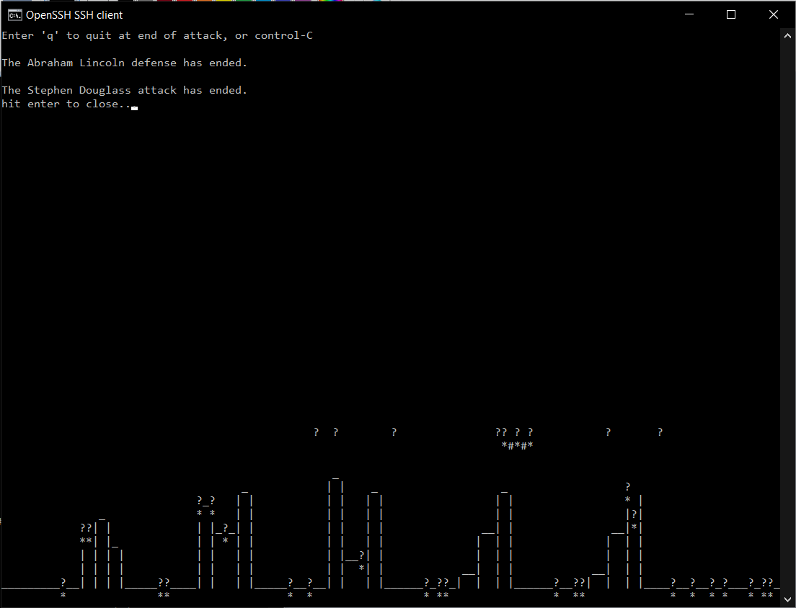

# city-defender
This course project uses the ncurses library to create a game where the user controls a shield to block missiles from falling on the city below. The course project focuses on multi-threaded programming.

## Build
`make`

## Run
`./threads <game_config_file>`

## Example

